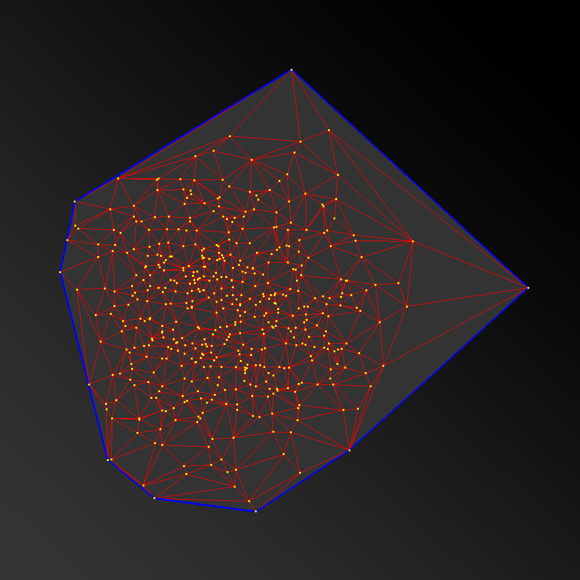
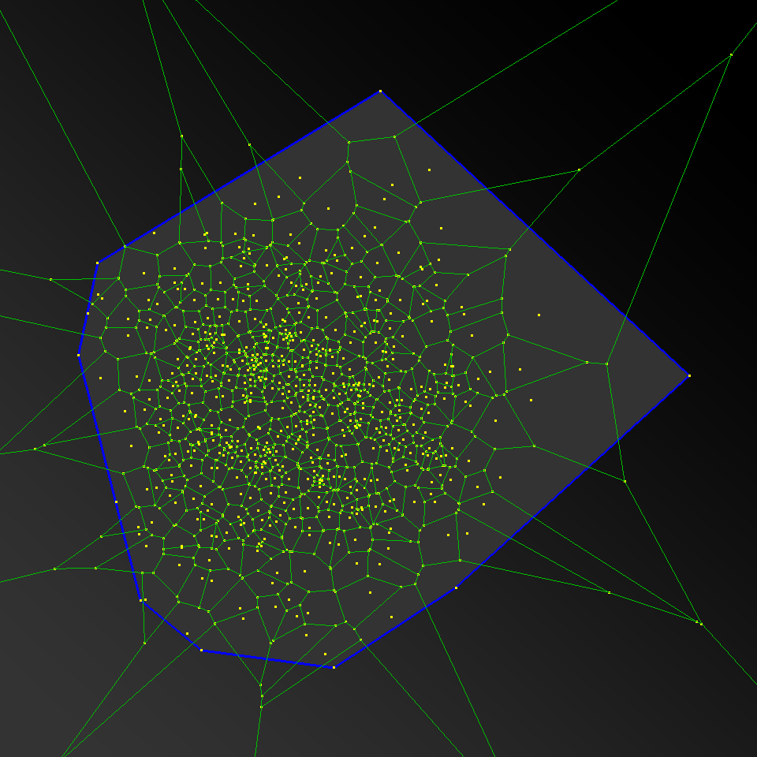
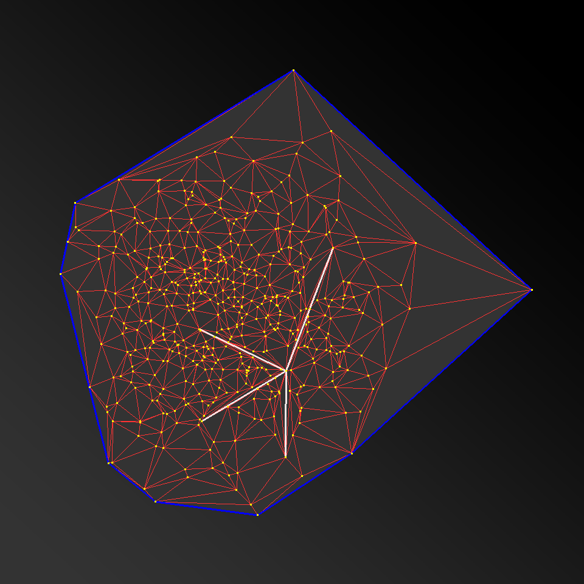

# DelaBella
## 2D Exact Delaunay triangulation

- Bunch of credits must go to David for inventing such beautiful algorithm (Newton Apple Wrapper):

  http://www.s-hull.org/

- It is pretty well described in this paper:

  https://arxiv.org/ftp/arxiv/papers/1602/1602.04707.pdf

- Currently DelaBella makes use of adaptive-exact predicates by William C. Lenthe

  https://github.com/wlenthe/GeometricPredicates

## What you can do with DelaBella?

- Delaunay triangulations

  

- Voronoi diagrams

  

- Constrained Delaunay triangulations

  

## Minimalistic DelaBella usage:

```cpp

#include "delabella.h"
// ...

	// somewhere in your code ...

	int POINTS = 1000000;

	typedef double MyCoord;

	struct MyPoint
	{
		MyCoord x;
		MyCoord y;
		// ...
	};

	MyPoint* cloud = new MyPoint[POINTS];

	srand(36341);

	// gen some random input
	for (int i = 0; i < POINTS; i++)
	{
		cloud[i].x = rand();
		cloud[i].y = rand();
	}

	IDelaBella2<MyCoord>* idb = IDelaBella2<MyCoord>::Create();

	int verts = idb->Triangulate(POINTS, &cloud->x, &cloud->y, sizeof(MyPoint));

	// if positive, all ok 
	if (verts>0)
	{
		int tris = idb->GetNumPolygons();
		const IDelaBella2<MyCoord>::Simplex* dela = idb->GetFirstDelaunaySimplex();
		for (int i = 0; i<tris; i++)
		{
			// do something with dela triangle 
			// ...
			dela = dela->next;
		}
	}
	else
	{
		// no points given or all points are colinear
		// make emergency call ...
	}

	delete[] cloud;
	idb->Destroy();

	// ...

```

## If you're migrating from the previous version 

```cpp

#define DELABELLA_LEGACY double // or float or whatever you've used before
#include "delabella.h"

// Your old code should work without additional changes
// ...

```

## On the go progress information for all lengthy functions


## `TODO: more examples`
